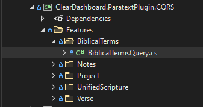
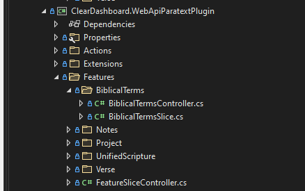
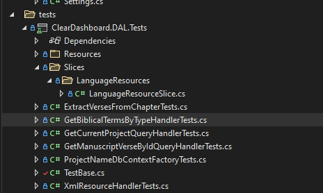
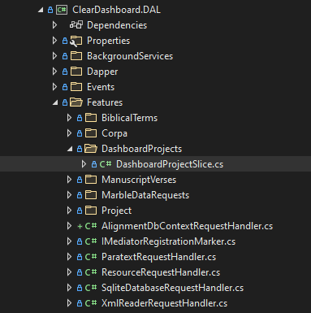
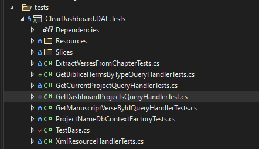

# CQRS Cheat Sheet

This serves as a guide for adding CQRS Feature Slices to the DAL, Paratext plug-in and eventually Server.

## Background

The `feature slice` or `vertical slice` architecutre is built on top of the CQRS and the Mediator design pattern.  CQRS stands 
for "Command Query Responsibility Segregation". This pattern mandates separate read and write operations in applications. 
In this pattern `read` operations are called `Queries` and `write` operations are called `Commands`. Adopting the 
`feature slice` architecture typically reduces difficult source code merges as individual developers are working in a single 
feature slice and are not making changes to a more traditional application layer at the same time as their team mates thus reducing 
the likelihood of conflicting code changes.

The Dashboard Data Access Layer (DAL) uses the open source library `MediatR` to realize the feature slice architecture. All data 
manipulation (reads and writes) should be implemented by creating a query/query handler pair or a command/command handler pair.

## Project setup

The `query/query handler` and `command/command handler` pairs can be organized in the same assembly or split into individual assemblies. 
The latter organizational pattern is used when a query or command is used to fetch or persist data in a distributed architecture like 
a call to get or save data via a RESTful web API.

A good example using a query/command in a distributed architecture is executing a query to get data from Paratext.  In this case 
a single query is created and the client side query handler is responsible for making an HTTP POST to the Paratext plug-in WEB API.  
When the HTTP POST is received, the controller deserializes the request into the query and another query handler is invoked to get the data from Paratext and return the result back to the original
query handler, which forwards the result to the calling process.


### A concrete example

 
 #### The call form the Dashboard app

 ``` csharp
      var result = await ExecuteRequest(new GetBiblicalTermsByTypeQuery(BiblicalTermsType.Project), CancellationToken.None).ConfigureAwait(false);
      if (result.Success)
      {
          biblicalTermsList = result.Data;
      }
 ```

 #### The query

``` csharp
 public record GetBiblicalTermsByTypeQuery(BiblicalTermsType BiblicalTermsType) : IRequest<RequestResult<List<BiblicalTermsData>>>
 {
        public BiblicalTermsType BiblicalTermsType { get; } = BiblicalTermsType;
 }
 ```
 #### The client-side query handler
 ``` csharp
  public class GetBiblicalTermsByTypeQueryHandler : ParatextRequestHandler<GetBiblicalTermsByTypeQuery, RequestResult<List<BiblicalTermsData>>, List<BiblicalTermsData>>
  {

        public GetBiblicalTermsByTypeQueryHandler([NotNull] ILogger<GetBiblicalTermsByTypeQueryHandler> logger) : base(logger)
        {
            //no-op
        }

        public override async Task<RequestResult<List<BiblicalTermsData>>> Handle(GetBiblicalTermsByTypeQuery request, CancellationToken cancellationToken)
        {
            return await ExecuteRequest("biblicalterms", request, cancellationToken);
        }
        
  }

  public abstract class ParatextRequestHandler<TRequest, TResponse, TData> : IRequestHandler<TRequest, TResponse>
        where TRequest : IRequest<TResponse>
        where TResponse: RequestResult<TData>
        where TData : new()
  {
        protected ILogger Logger { get; }

        protected HttpClient HttpClient { get; private set; }

        protected ParatextRequestHandler(ILogger logger)
        {
            Logger = logger;

            HttpClient = new HttpClient
            {
                BaseAddress = new Uri("http://localhost:9000/api/")
            };
        }

        public abstract Task<TResponse> Handle(TRequest request, CancellationToken cancellationToken);

        protected async  Task<TResponse> ExecuteRequest(string requestUri, TRequest request, CancellationToken cancellationToken)
        {
            try
            {
                var response = await HttpClient.PostAsJsonAsync<TRequest>(requestUri, request, cancellationToken).ConfigureAwait(false);

                var result = await response.Content.ReadAsAsync<TResponse>(cancellationToken);

                if (result.Success)
                {
                    Logger.LogInformation($"Successfully called {HttpClient.BaseAddress}/{requestUri}.");
                }
                else
                {
                    Logger.LogError($"Call to {HttpClient.BaseAddress}/{requestUri} was not successful: {result.Message}");
                }

                return result;

            }
            catch (Exception ex)
            {
                return (TResponse)new RequestResult<TData>(new TData(), false, ex.Message);
            }
        }

  }
 ```

NOTE for DIRK: the "biblicalterms" in the line `return await ExecuteRequest("biblicalterms", request, cancellationToken);` is NOT the folder or namespace names.  But rather, the controller's prefix minus the word "Controller".  So if your controller is `BiblicalTermsController`, then your route is "biblicalterms".  Note that it is case insensitive. 


 #### The Paratext query handler
 ``` csharp
 public class BiblicalTermsController : FeatureSliceController
 {
        public BiblicalTermsController(IMediator mediator, ILogger<BiblicalTermsController> logger) : base(mediator, logger)
        {

        }

        [HttpPost]
        public async Task<RequestResult<List<BiblicalTermsData>>> GetAsync([FromBody] GetBiblicalTermsByTypeQuery command)
        {
            var result = await ExecuteRequestAsync<RequestResult<List<BiblicalTermsData>>, List<BiblicalTermsData>>(command, CancellationToken.None);
            return result;

        }

  }

  public class GetBiblicalTermsByTypeQueryHandler : IRequestHandler<GetBiblicalTermsByTypeQuery, RequestResult<List<BiblicalTermsData>>>
    {
        private readonly IWindowPluginHost _host;
        private readonly IProject _project;
        private readonly ILogger<GetBiblicalTermsByTypeQueryHandler> _logger;

        public GetBiblicalTermsByTypeQueryHandler(IWindowPluginHost host, IProject project, ILogger<GetBiblicalTermsByTypeQueryHandler> logger)
        {
            _host = host;
            _project = project;
            _logger = logger;
        }
        public Task<RequestResult<List<BiblicalTermsData>>> Handle(GetBiblicalTermsByTypeQuery request, CancellationToken cancellationToken)
        {

            var biblicalTermList = request.BiblicalTermsType == BiblicalTermsType.All
                ? _host.GetBiblicalTermList(BiblicalTermListType.All)
                : _project.BiblicalTermList;

            var queryResult = new RequestResult<List<BiblicalTermsData>>(new List<BiblicalTermsData>());
            try
            {
                queryResult.Data = ProcessBiblicalTerms(_project, biblicalTermList);
            }
            catch (Exception ex)
            {
                queryResult.Success = false;
                queryResult.Message = ex.Message;
            }

            return Task.FromResult(queryResult);
        }
        ... other methods elided for clarity
  }

 ```
 ----------------------
 ## Get or persisting data to Paratext

 1.  Add a command or query to the `ClearDashboard.ParatextPlugin.CQRS` project in the proper subfolder the `Features` folder, for examaple `BiblicalTerms`

 

        a. Your query or command should be a .Net record type which inherits from IResult<T>, where T is RequestResult<TYourReturnType>.
 
  ```csharp
   public record GetBiblicalTermsByTypeQuery(BiblicalTermsType BiblicalTermsType) : IRequest<RequestResult<List<BiblicalTermsData>>>
    {
          public BiblicalTermsType BiblicalTermsType { get; } = BiblicalTermsType;
    }
   ```
  2. Add a Web API controller and a query or command handler to the proper subfolder in the `Features` folder of the `ClearDashboard.WebApiParatextPlugin` project, for example `BiblicalTerms` 



        a. Your controller is a facade on top of MediatR.  Inherit from `FeatureSliceController`
 ```csharp
      public class BiblicalTermsController : FeatureSliceController
      {
          public BiblicalTermsController(IMediator mediator, ILogger<BiblicalTermsController> logger) : base(mediator, logger)
          {

          }

          [HttpPost]
          public async Task<RequestResult<List<BiblicalTermsData>>> GetAsync([FromBody] GetBiblicalTermsByTypeQuery command)
          {
              var result = await ExecuteRequestAsync<RequestResult<List<BiblicalTermsData>>, List<BiblicalTermsData>>(command, CancellationToken.None);
              return result;

          }
      }
 ```
        b. Your command or query handler should inherit from `IRequestHandler<TYourRequestType, RequestResult<TYourReturnType>>`

```csharp
         public class GetBiblicalTermsByTypeQueryHandler : IRequestHandler<GetBiblicalTermsByTypeQuery, RequestResult<List<BiblicalTermsData>>>
    {
        private readonly IWindowPluginHost _host;
        private readonly IProject _project;
        private readonly ILogger<GetBiblicalTermsByTypeQueryHandler> _logger;

        public GetBiblicalTermsByTypeQueryHandler(IWindowPluginHost host, IProject project, ILogger<GetBiblicalTermsByTypeQueryHandler> logger)
        {
            _host = host;
            _project = project;
            _logger = logger;
        }
        public Task<RequestResult<List<BiblicalTermsData>>> Handle(GetBiblicalTermsByTypeQuery request, CancellationToken cancellationToken)
        {

            var biblicalTermList = request.BiblicalTermsType == BiblicalTermsType.All
                ? _host.GetBiblicalTermList(BiblicalTermListType.All)
                : _project.BiblicalTermList;

            var queryResult = new RequestResult<List<BiblicalTermsData>>(new List<BiblicalTermsData>());
            try
            {
                queryResult.Data = ProcessBiblicalTerms(_project, biblicalTermList);
            }
            catch (Exception ex)
            {
                queryResult.Success = false;
                queryResult.Message = ex.Message;
            }

            return Task.FromResult(queryResult);
        }
```
3. Add a command or query handler to  the `Features` folder of `ClearDashboard.DAL` project, i.e. `BiblicalTerms`


        a. Your command or query handler should inherit from `ParatextRequestHandler`
```csharp
 public class GetBiblicalTermsByTypeQueryHandler : ParatextRequestHandler<GetBiblicalTermsByTypeQuery, RequestResult<List<BiblicalTermsData>>, List<BiblicalTermsData>>
 {

        public GetBiblicalTermsByTypeQueryHandler([NotNull] ILogger<GetBiblicalTermsByTypeQueryHandler> logger) : base(logger)
        {
            //no-op
        }

        public override async Task<RequestResult<List<BiblicalTermsData>>> Handle(GetBiblicalTermsByTypeQuery request, CancellationToken cancellationToken)
        {
            return await ExecuteRequest("biblicalterms", request, cancellationToken);
        }
        
 }
```

4. Add a unit test to the `ClearDashboard.DAL.Tests` project



            a.  Please note Paratext must be running with the Paratext plug-in properly installed in order for your test to pass.
            b.  Your test should inherit from `TestBase`.
            c.  To test the command or query call `ExecuteAndTestRequest<TRequestType, TResultType, TDataTYpe>` as shown below.
            d.  The method will make the call to Paratext and will test that the call has returned data.
            e.  You can further test the result in your test as required.

```csharp
public class GetBiblicalTermsByTypeHandlerTests : TestBase
{
    public GetBiblicalTermsByTypeHandlerTests(ITestOutputHelper output) : base(output)
    {
        //no-op
    }

    [Fact]
    public async Task GetAllBiblicalTermsTest()
    {
       var result =  await ExecuteAndTestRequest<GetBiblicalTermsByTypeQuery, RequestResult<List<BiblicalTermsData>>, List<BiblicalTermsData>>(new GetBiblicalTermsByTypeQuery(BiblicalTermsType.All));
    }

    [Fact]
    public async Task GetProjectBiblicalTermsTest()
    {
        var result = await ExecuteAndTestRequest<GetBiblicalTermsByTypeQuery, RequestResult<List<BiblicalTermsData>>, List<BiblicalTermsData>>(new GetBiblicalTermsByTypeQuery(BiblicalTermsType.Project));
    }
}
```
-------------------------

## Getting or persiting data form a local resource

There are several base classes that you can use to retrieve and persist local data

a.  `XmlReaderREquestHandler` is used to get data from a local XML resource file
b.  `SqliteDatabaseRequestHanlder` is used to get or persist data from an ad-hoc Sqlite database
c.  `AlignmentDcContextRequestHandler` is used to get or persist data from a project alignment database context
c.  `ResourceRequestHandler` is used to get data from a resource, like a enumerating a directory for file names.
d.  `IRequest<RequestResult<YourType>`


1.  Add a new class to the proper folder in the 'Features` folder of the `ClearDashboard.DAL` project, for example `DashboardProjectSlice.cs`
2.  Add a query or command as well as your queery or command handler to the newly created class



3. As before the query or command should be a .Net  `record` which inherits from IResult<T>, where T is RequestResult<TYourReturnType>.
```csharp
 public record GetDashboardProjectQuery : IRequest<RequestResult<ObservableCollection<DashboardProject>>>;

```
4. Your query or command handler should inherit from one of the base classes defined above.

```csharp
public class GetDashboardProjectsQueryHandler : ResourceRequestHandler<GetDashboardProjectsQuery,
        RequestResult<ObservableCollection<DashboardProject>>, ObservableCollection<DashboardProject>>
    {
        public GetDashboardProjectsQueryHandler(ILogger<GetDashboardProjectsQueryHandler> logger) : base(logger)
        {
        }

       
        protected override string ResourceName { get; set; } = FilePathTemplates.ProjectBaseDirectory;

        public override Task<RequestResult<ObservableCollection<DashboardProject>>> Handle(GetDashboardProjectsQuery request, CancellationToken cancellationToken)
        {
            var queryResult = new RequestResult<ObservableCollection<DashboardProject>>(new ObservableCollection<DashboardProject>());
            try
            {
                queryResult.Data = ProcessData();
            }
            catch (Exception ex)
            {
                LogAndSetUnsuccessfulResult(ref queryResult, $"An unexpected error occurred while enumerating the {ResourceName} directory for projects", ex);
            }

            return Task.FromResult(queryResult);

        }
        ... code elided for clarity
    }
```

5. Add a unit test to the `ClearDashboard.DAL.Tests` project



            a.  Your test should inherit from `TestBase`.
            b.  To test the command or query call `ExecuteAndTestRequest<TRequestType, TResultType, TDataTYpe>` as shown below.
            c.  The method will execute the query or command and will test that the call has returned data.
            d.  You can further test the result in your test as required.

  ```csharp
   public class GetDashboardProjectsQueryHandlerTest : TestBase
    {
        public GetDashboardProjectsQueryHandlerTest([NotNull] ITestOutputHelper output) : base(output)
        {
        }

        [Fact]
        public async Task GetDashboardProjectsTest()
        {
            var result = await ExecuteAndTestRequest<GetDashboardProjectQuery, RequestResult<ObservableCollection<DashboardProject>>, ObservableCollection<DashboardProject>>(new GetDashboardProjectQuery());
        }
    }
  ```

## Sending messages to Paratext Example

In the Dashboard app, we need to send verse changes from Dashboard to Paratext.  While similar to the prior to the example presented prior, there are a few changes which can be highlighted in this example.

1. In the Dashboard, verse changes that happen from the BookChapterVerse control are picked up by the WorkSpaceViewModel.  In this module, we pick up the verse change as a string and send it through to the Mediator.

```csharp
    // send to the event aggregator for everyone else to hear about a verse change
    _eventAggregator.PublishOnUIThreadAsync(new VerseChangedMessage(CurrentBcv.BBBCCCVVV));

    // push to Paratext
    if (ParatextSync)
    {
        _ = Task.Run(() => ExecuteRequest(new SetCurrentVerseCommand(CurrentBcv.BBBCCCVVV), CancellationToken.None));
    }
```

The first `_eventAggregator.PublishOnUIThreadAsync` sends a notice out to the rest of the application that the verse control has changed.  The `ExecuteRequest(new SetCurrentVerseCommand(CurrentBcv.BBBCCCVVV), CancellationToken.None)` is what starts the process of sending the command over to Paratext.  Note in this case, we wrap that request within a `Task.Run()` to have it run in the background and not await the command's response back.

2. The `SetCurrentVerseCommand` is a record defined the following way:

```csharp
namespace ClearDashboard.ParatextPlugin.CQRS.Features.Verse
{
    public record SetCurrentVerseCommand(string Verse) : IRequest<RequestResult<string>>
    {
        public string Verse { get; } = Verse;
    }
}
```

3. Mediator sends this to the handler here:

```csharp
namespace ClearDashboard.DataAccessLayer.Features.Verse
{
    public class SetCurrentVerseCommandHandler : ParatextRequestHandler<SetCurrentVerseCommand, RequestResult<string>, string>
    {

        public SetCurrentVerseCommandHandler([NotNull] ILogger<SetCurrentVerseCommandHandler> logger) : base(logger)
        {
            //no-op
        }

        public override async Task<RequestResult<string>> Handle(SetCurrentVerseCommand request, CancellationToken cancellationToken)
        {
            return await ExecuteRequest("verse", request, cancellationToken, HttpVerb.PUT);
        }

    }
}
```

The thing to notice is that on the `ExecuteRequest("verse", request, cancellationToken, HttpVerb.PUT);` we have added in the final `HttpVerb.PUT` as we are sending data.  This normally defaults to `HttpVerb.GET`.

4.  The unit test for this is defined:

```csharp
namespace ClearDashboard.DAL.Tests
{
    public class SetCurrentVerseCommandHandlerTests : TestBase
    {
        public SetCurrentVerseCommandHandlerTests(ITestOutputHelper output) : base(output)
        {
        }

        [Fact]
        private async Task SetCurrentVerseTest()
        {
            var result =
                await ExecuteAndTestRequest<SetCurrentVerseCommand, RequestResult<string>, string>(
                    new SetCurrentVerseCommand("042001001"));

            Assert.True(result.Success);
        }
    }
}
```

5. On the Paratext side, we need to handle the receiving of this message. Working in reverse, the unit test for receiving a verse change this looks like:

```csharp
namespace ClearDashboard.WebApiParatextPlugin.Tests
{
    public class SetCurrentVerseCommandHandlerTests : TestBase
    {
        public SetCurrentVerseCommandHandlerTests(ITestOutputHelper output) : base(output)
        {
        }

        [Fact]
        public async Task SetCurrentVerseTest()
        {
            string verse = "040001001";
            try
            {
                await StartParatext();

                var client = CreateHttpClient();

                var response =
                    await client.PutAsJsonAsync<SetCurrentVerseCommand>("verse", new SetCurrentVerseCommand(verse));

                Assert.True(response.IsSuccessStatusCode);
                var result = await response.Content.ReadAsAsync<RequestResult<string>>();

                Assert.NotNull(result);
                Assert.True(result.Success);
                Assert.NotNull(result.Data);
                Assert.Equal(result.Data, verse);

                Output.WriteLine(result.Data);
            }
            finally
            {
                await StopParatext();
            }
        }
    }
}
```

Again, notice the `client.PutAsJsonAsync` Put command part of this as we are passing data.

6. The record type that Paratext is receiving is found here and is defined like the DAL side:

```csharp
namespace ClearDashboard.ParatextPlugin.CQRS.Features.Verse
{
    public record SetCurrentVerseCommand(string Verse) : IRequest<RequestResult<string>>
    {
        public string Verse { get; } = Verse;
    }
}
```

7. The Handler for this looks like (the second [HttpPut]):

```csharp
namespace ClearDashboard.WebApiParatextPlugin.Features.Verse
{
    public class VerseController : FeatureSliceController
    {
        public VerseController(IMediator mediator, ILogger<VerseController> logger) : base(mediator, logger)
        {

        }

        [HttpPost]
        public async Task<RequestResult<string>> GetAsync([FromBody] GetCurrentVerseQuery query)
        {
            return await ExecuteRequestAsync<RequestResult<string>, string>(query, CancellationToken.None);
        }

        [HttpPut]
        public async Task<RequestResult<string>> PutAsync([FromBody] SetCurrentVerseCommand command)
        {
            return await ExecuteRequestAsync<RequestResult<string>, string>(command, CancellationToken.None);
        }

    }
}
```

8. In the slice, we handle this request like:

```csharp
namespace ClearDashboard.WebApiParatextPlugin.Features.Verse
{
    public class SetCurrentVerseCommandHandler : IRequestHandler<SetCurrentVerseCommand, RequestResult<string>>
    {
        private readonly IVerseRef _verseRef;
        private readonly ILogger<SetCurrentVerseCommandHandler> _logger;
        private readonly IProject _project;
        private readonly MainWindow _mainWindow;


        public SetCurrentVerseCommandHandler(IVerseRef verseRef, ILogger<SetCurrentVerseCommandHandler> logger,
            IProject project, MainWindow mainWindow)
        {
            _mainWindow = mainWindow;
            _project = project;
            _verseRef = verseRef;
            _logger = logger;
        }

        public Task<RequestResult<string>> Handle(SetCurrentVerseCommand request, CancellationToken cancellationToken)
        {

            // get back on UI thread
            Dispatcher.CurrentDispatcher.Invoke(new Action(() =>
            {
                // ReSharper disable once InconsistentNaming
                var BBBCCCVVV = request.Verse.PadLeft(9, '0');
                int book = 1;
                int chapter = 1;
                int verse = 1;

                try
                {
                    book = int.Parse(BBBCCCVVV.Substring(0, 3));
                    chapter = int.Parse(BBBCCCVVV.Substring(3, 3));
                    verse = int.Parse(BBBCCCVVV.Substring(6, 3));
                    _mainWindow.SwitchVerseReference(book, chapter, verse);
                }
                catch (Exception e)
                {
                    _logger.LogError(e.Message);
                }
            }));

            return Task.FromResult(new RequestResult<string>(request.Verse));
        }
    }
}
```

Notice that since we are doing a change to something that is on the UI, we have to put the result back on the UI thread.

9. In the MainWindow of our plugin, we set up a new versification reference based upon our current project like:

```csharp
    public void SwitchVerseReference(int book, int chapter, int verse)
    {
        if (this.InvokeRequired)
        {
            Action safeWrite = delegate { SwitchVerseReference(book, chapter, verse); };
            this.Invoke(safeWrite);
        }
        else
        {
            try
            {
                // set up a new Versification reference for this verse
                var newVerse = _project.Versification.CreateReference(book, chapter, verse);
                _host.SetReferenceForSyncGroup(newVerse, _host.ActiveWindowState.SyncReferenceGroup);
            }
            catch (Exception ex)
            {
                Log.Error(ex.Message);
                AppendText(Color.Red, ex.Message);
            }
        }
    }
```

This step is required to get the verse into the same versification pattern that our project resides within.  We use the `_host` object to actually change the reference using our new verse.

Paratext will now update the verse internally for the current Sync Group.