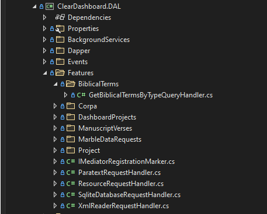

# CQRS Cheat Sheet

This serves as a guide for adding CQRS Feature Slices to the DAL, Paratext plug-in and eventually Server.

## Background

The `feature slice` or `vertical slice` architecutre is built on top of the CQRS and the Mediator design pattern.  CQRS stands 
for "Command Query Responsibility Segregation". This pattern mandates separate read and write operations in applications. 
In this pattern `read` operations are called `Queries` and `write` operations are called `Commands`. Adopting the 
`feature slice` architecture typically reduces difficult source code merges as individual developers are working in a single 
feature slice and are not making changes to a more traditional application layer at the same time as their team mates thus reducing 
the likelihood of conflicting code changes.

The Dashboard Data Access Layer (DAL) uses the open source library `MediatR` to realize the feature slice architecture. All data 
manipulation (reads and writes) should be implemented by creating a query/query handler pair or a command/command handler pair.

## Project setup

The `query/query handler` and `command/command handler` pairs can be organized in the same assembly or split into individual assemblies. 
The latter organizational pattern is used when a query or command is used to fetch or persist data in a distributed architecture like 
a call to get or save data via a RESTful web API.

A good example using a query/command in a distributed architecture is executing a query to get data from Paratext.  In this case 
a single query is created and the client side query handler is responsible for making an HTTP POST to the Paratext plug-in WEB API.  
When the HTTP POST is received, the controller deserializes the request into the query and another query handler is invoked to get the data from Paratext and return the result back to the original
query handler, which forwards the result to the calling process.


### A concrete example

 
 #### The call form the Dashboard app

 ``` csharp
      var result = await ExecuteCommand(new GetBiblicalTermsByTypeQuery(BiblicalTermsType.Project), CancellationToken.None).ConfigureAwait(false);
      if (result.Success)
      {
          biblicalTermsList = result.Data;
      }
 ```

 #### The query

``` csharp
 public record GetBiblicalTermsByTypeQuery(BiblicalTermsType BiblicalTermsType) : IRequest<RequestResult<List<BiblicalTermsData>>>
 {
        public BiblicalTermsType BiblicalTermsType { get; } = BiblicalTermsType;
 }
 ```
 #### The client-side query handler
 ``` csharp
  public class GetBiblicalTermsByTypeQueryHandler : ParatextRequestHandler<GetBiblicalTermsByTypeQuery, RequestResult<List<BiblicalTermsData>>, List<BiblicalTermsData>>
  {

        public GetBiblicalTermsByTypeQueryHandler([NotNull] ILogger<GetBiblicalTermsByTypeQueryHandler> logger) : base(logger)
        {
            //no-op
        }

        public override async Task<RequestResult<List<BiblicalTermsData>>> Handle(GetBiblicalTermsByTypeQuery request, CancellationToken cancellationToken)
        {
            return await ExecuteRequest("biblicalterms", request, cancellationToken);
        }
        
  }

  public abstract class ParatextRequestHandler<TRequest, TResponse, TData> : IRequestHandler<TRequest, TResponse>
        where TRequest : IRequest<TResponse>
        where TResponse: RequestResult<TData>
        where TData : new()
  {
        protected ILogger Logger { get; }

        protected HttpClient HttpClient { get; private set; }

        protected ParatextRequestHandler(ILogger logger)
        {
            Logger = logger;

            HttpClient = new HttpClient
            {
                BaseAddress = new Uri("http://localhost:9000/api/")
            };
        }

        public abstract Task<TResponse> Handle(TRequest request, CancellationToken cancellationToken);

        protected async  Task<TResponse> ExecuteRequest(string requestUri, TRequest request, CancellationToken cancellationToken)
        {
            try
            {
                var response = await HttpClient.PostAsJsonAsync<TRequest>(requestUri, request, cancellationToken).ConfigureAwait(false);

                var result = await response.Content.ReadAsAsync<TResponse>(cancellationToken);

                if (result.Success)
                {
                    Logger.LogInformation($"Successfully called {HttpClient.BaseAddress}/{requestUri}.");
                }
                else
                {
                    Logger.LogError($"Call to {HttpClient.BaseAddress}/{requestUri} was not successful: {result.Message}");
                }

                return result;

            }
            catch (Exception ex)
            {
                return (TResponse)new RequestResult<TData>(new TData(), false, ex.Message);
            }
        }

  }
 ```

 #### The Paratext query handler
 ``` csharp
 public class BiblicalTermsController : FeatureSliceController
 {
        public BiblicalTermsController(IMediator mediator, ILogger<BiblicalTermsController> logger) : base(mediator, logger)
        {

        }

        [HttpPost]
        public async Task<RequestResult<List<BiblicalTermsData>>> GetAsync([FromBody] GetBiblicalTermsByTypeQuery command)
        {
            var result = await ExecuteRequestAsync<RequestResult<List<BiblicalTermsData>>, List<BiblicalTermsData>>(command, CancellationToken.None);
            return result;

        }

  }

  public class GetBiblicalTermsByTypeQueryHandler : IRequestHandler<GetBiblicalTermsByTypeQuery, RequestResult<List<BiblicalTermsData>>>
    {
        private readonly IWindowPluginHost _host;
        private readonly IProject _project;
        private readonly ILogger<GetBiblicalTermsByTypeQueryHandler> _logger;

        public GetBiblicalTermsByTypeQueryHandler(IWindowPluginHost host, IProject project, ILogger<GetBiblicalTermsByTypeQueryHandler> logger)
        {
            _host = host;
            _project = project;
            _logger = logger;
        }
        public Task<RequestResult<List<BiblicalTermsData>>> Handle(GetBiblicalTermsByTypeQuery request, CancellationToken cancellationToken)
        {

            var biblicalTermList = request.BiblicalTermsType == BiblicalTermsType.All
                ? _host.GetBiblicalTermList(BiblicalTermListType.All)
                : _project.BiblicalTermList;

            var queryResult = new RequestResult<List<BiblicalTermsData>>(new List<BiblicalTermsData>());
            try
            {
                queryResult.Data = ProcessBiblicalTerms(_project, biblicalTermList);
            }
            catch (Exception ex)
            {
                queryResult.Success = false;
                queryResult.Message = ex.Message;
            }

            return Task.FromResult(queryResult);
        }
        ... other methods elided for clarity
  }

 ```
 ----------------------
 ## Get or persisting data to Paratext

 1.  Add a command or query to the `ClearDashboard.ParatextPlugin.CQRS` project in the proper subfolder the `Features` folder, for examaple `BiblicalTerms`

 

        a. Your query or command should be a .Net record type which inherits from IResult<T>, where T is RequestResult<TYourReturnType>.
 
  ```csharp
   public record GetBiblicalTermsByTypeQuery(BiblicalTermsType BiblicalTermsType) : IRequest<RequestResult<List<BiblicalTermsData>>>
    {
          public BiblicalTermsType BiblicalTermsType { get; } = BiblicalTermsType;
    }
   ```
  2. Add a Web API controller and a query or command handler to the proper subfolder in the `Features` folder of the `ClearDashboard.WebApiParatextPlugin` project, for example `BiblicalTerms` 


        a. Your controller is a facade on top of MediatR.  Inherit from `FeatureSliceController`
 ```csharp
      public class BiblicalTermsController : FeatureSliceController
      {
          public BiblicalTermsController(IMediator mediator, ILogger<BiblicalTermsController> logger) : base(mediator, logger)
          {

          }

          [HttpPost]
          public async Task<RequestResult<List<BiblicalTermsData>>> GetAsync([FromBody] GetBiblicalTermsByTypeQuery command)
          {
              var result = await ExecuteRequestAsync<RequestResult<List<BiblicalTermsData>>, List<BiblicalTermsData>>(command, CancellationToken.None);
              return result;

          }
      }
 ```
        b. Your command or query handler should inherit from `IRequestHandler<TYourRequestType, RequestResult<TYourReturnType>>`

```csharp
         public class GetBiblicalTermsByTypeQueryHandler : IRequestHandler<GetBiblicalTermsByTypeQuery, RequestResult<List<BiblicalTermsData>>>
    {
        private readonly IWindowPluginHost _host;
        private readonly IProject _project;
        private readonly ILogger<GetBiblicalTermsByTypeQueryHandler> _logger;

        public GetBiblicalTermsByTypeQueryHandler(IWindowPluginHost host, IProject project, ILogger<GetBiblicalTermsByTypeQueryHandler> logger)
        {
            _host = host;
            _project = project;
            _logger = logger;
        }
        public Task<RequestResult<List<BiblicalTermsData>>> Handle(GetBiblicalTermsByTypeQuery request, CancellationToken cancellationToken)
        {

            var biblicalTermList = request.BiblicalTermsType == BiblicalTermsType.All
                ? _host.GetBiblicalTermList(BiblicalTermListType.All)
                : _project.BiblicalTermList;

            var queryResult = new RequestResult<List<BiblicalTermsData>>(new List<BiblicalTermsData>());
            try
            {
                queryResult.Data = ProcessBiblicalTerms(_project, biblicalTermList);
            }
            catch (Exception ex)
            {
                queryResult.Success = false;
                queryResult.Message = ex.Message;
            }

            return Task.FromResult(queryResult);
        }
```
3. Add a command or query handler to  the `Features` folder of `ClearDashboard.DAL` project, i.e. `BiblicalTerms`



        a. Your command or query handler should inherit from `ParatextRequestHandler`
```csharp
 public class GetBiblicalTermsByTypeQueryHandler : ParatextRequestHandler<GetBiblicalTermsByTypeQuery, RequestResult<List<BiblicalTermsData>>, List<BiblicalTermsData>>
 {

        public GetBiblicalTermsByTypeQueryHandler([NotNull] ILogger<GetBiblicalTermsByTypeQueryHandler> logger) : base(logger)
        {
            //no-op
        }

        public override async Task<RequestResult<List<BiblicalTermsData>>> Handle(GetBiblicalTermsByTypeQuery request, CancellationToken cancellationToken)
        {
            return await ExecuteRequest("biblicalterms", request, cancellationToken);
        }
        
 }
```

4. Add a unit test to the `ClearDashboard.DAL.Tests` project


            a.  Please note Paratext must be running with the Paratext plug-in properly installed in order for your test to pass.
            b.  Your test should inherit from `TestBase`.
            c.  To test the command or query call `ExecuteAndTestRequest<TRequestType, TResultType, TDataTYpe>` as shown below.
            d.  The method will make the call to Paratext and will test that the call has returned data.
            e.  You can further test the result in your test as required.

```csharp
public class GetBiblicalTermsByTypeHandlerTests : TestBase
{
    public GetBiblicalTermsByTypeHandlerTests(ITestOutputHelper output) : base(output)
    {
        //no-op
    }

    [Fact]
    public async Task GetAllBiblicalTermsTest()
    {
       var result =  await ExecuteAndTestRequest<GetBiblicalTermsByTypeQuery, RequestResult<List<BiblicalTermsData>>, List<BiblicalTermsData>>(new GetBiblicalTermsByTypeQuery(BiblicalTermsType.All));
    }

    [Fact]
    public async Task GetProjectBiblicalTermsTest()
    {
        var result = await ExecuteAndTestRequest<GetBiblicalTermsByTypeQuery, RequestResult<List<BiblicalTermsData>>, List<BiblicalTermsData>>(new GetBiblicalTermsByTypeQuery(BiblicalTermsType.Project));
    }
}
```
-------------------------

## Getting or persiting data form a local resource

There are several base classes that you can use to retrieve and persist local data

a.  `XmlReaderREquestHandler` is used to get data from a local XML resource file
b.  `SqliteDatabaseRequestHanlder` is used to get or persist data from an ad-hoc Sqlite database
c.  `AlignmentDcContextRequestHandler` is used to get or persist data from a project alignment database context
c.  `ResourceRequestHandler` is used to get data from a resource, like a enumerating a directory for file names.
d.  `IRequest<RequestResult<YourType>`


1.  Add a new class to the proper folder in the 'Features` folder of the `ClearDashboard.DAL` project, for example `DashboardProjectSlice.cs`
2.  Add a query or command as well as your queery or command handler to the newly created class


3. As before the query or command should be a .Net  `record` which inherits from IResult<T>, where T is RequestResult<TYourReturnType>.
```csharp
 public record GetDashboardProjectQuery : IRequest<RequestResult<ObservableCollection<DashboardProject>>>;

```
4. Your query or command handler should inherit from one of the base classes defined above.

```csharp
public class GetDashboardProjectsQueryHandler : ResourceRequestHandler<GetDashboardProjectsQuery,
        RequestResult<ObservableCollection<DashboardProject>>, ObservableCollection<DashboardProject>>
    {
        public GetDashboardProjectsQueryHandler(ILogger<GetDashboardProjectsQueryHandler> logger) : base(logger)
        {
        }

       
        protected override string ResourceName { get; set; } = FilePathTemplates.ProjectBaseDirectory;

        public override Task<RequestResult<ObservableCollection<DashboardProject>>> Handle(GetDashboardProjectsQuery request, CancellationToken cancellationToken)
        {
            var queryResult = new RequestResult<ObservableCollection<DashboardProject>>(new ObservableCollection<DashboardProject>());
            try
            {
                queryResult.Data = ProcessData();
            }
            catch (Exception ex)
            {
                LogAndSetUnsuccessfulResult(ref queryResult, $"An unexpected error occurred while enumerating the {ResourceName} directory for projects", ex);
            }

            return Task.FromResult(queryResult);

        }
        ... code elided for clarity
    }
```

5. Add a unit test to the `ClearDashboard.DAL.Tests` project


            a.  Your test should inherit from `TestBase`.
            b.  To test the command or query call `ExecuteAndTestRequest<TRequestType, TResultType, TDataTYpe>` as shown below.
            c.  The method will execute the query or command and will test that the call has returned data.
            d.  You can further test the result in your test as required.

  ```csharp
   public class GetDashboardProjectsQueryHandlerTest : TestBase
    {
        public GetDashboardProjectsQueryHandlerTest([NotNull] ITestOutputHelper output) : base(output)
        {
        }

        [Fact]
        public async Task GetDashboardProjectsTest()
        {
            var result = await ExecuteAndTestRequest<GetDashboardProjectQuery, RequestResult<ObservableCollection<DashboardProject>>, ObservableCollection<DashboardProject>>(new GetDashboardProjectQuery());
        }
    }
  ```
