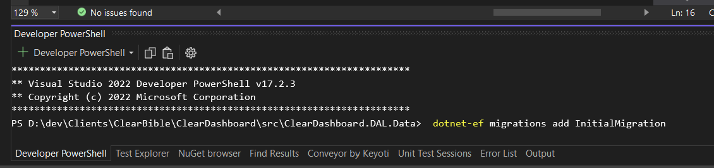

# EF Core Commands


### To create a database migration

While we are in active development, it is desirable to complerely regenerate the migrations used by EF Core to
create the database.  Follow the steps below to regenerate the intial migration:

Before you begin, you may need to execute ```dotnet tool update --global dotnet-ef``` from a command prompt or terminal session.

  1. Delete the ```Migrations``` folder in the ```ClearDashboard.DAL.Data``` project 
        
		

 2. Right click on the ```ClearDashboard.DAL.Data``` project and choose ```Open in Terminal```
	
	 

3. In the terminal window, copy and past the following command:
		
    ```dotnet-ef migrations add InitialMigration```
4. The project will rebuild and the the Migrations folder with your migration should be created.  Pay attention to any warnings and errors generated during the process.  Correct the warnings an errors and repeat steps 1-3 until you have a clean migration.

### To add addtional migration

To add additional migrations, open a terminal window by right clicking on the ```ClearDashboard.DAL.Data``` project and choosing ```Open in Terminal``` then execute the following command:

```dotnet-ef migrations add <your-migration-name>```

## Miscellany

### To apply migrations

 ```dotnet-ef database update```    


### To reverse engineer a SQLite database

	```dotnet ef dbcontext scaffold "data source=e:\downloads\alignment.sqlite" Microsoft.EntityFrameworkCore.Sqlite --output-dir Models --verbose```