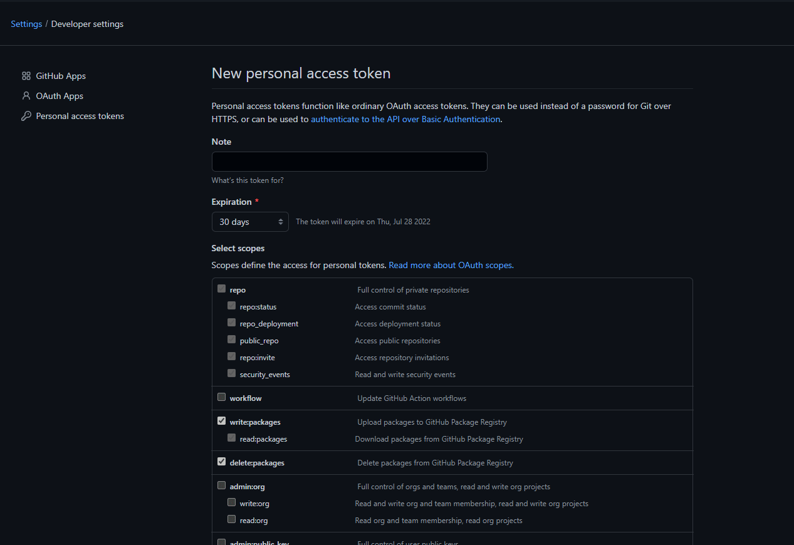

# Add a nuget.config file

In order to properly resolve nuget packages and to be able to publish nuget packages to GitHub,
you will need to add a `nuget.config` file to the same directory as `ClearDashboard.sln`.

1.  Cut and paste the following into a new text file named `nuget.config`

``` XML
<?xml version="1.0" encoding="utf-8"?>
<configuration>
    <packageSources>
        <clear />
        <add key="ClearBible" value="https://nuget.pkg.github.com/clear-bible/index.json" />
        <add key="nuget.org" value="https://api.nuget.org/v3/index.json" />
         <add key="myget caliburn-micro" value="https://www.myget.org/F/caliburn-micro-builds/api/v3/index.json" />
    </packageSources>
    <packageSourceMapping>
    <packageSource key="nuget.org">
        <package pattern="*" />
    </packageSource>
    <packageSource key="ClearBible">
        <package pattern="*" />
    </packageSource>
    </packageSourceMapping>
        <packageSourceCredentials>
            <ClearBible>
                <add key="Username" value="<your github name>" />
                <add key="ClearTextPassword" value="<your PAT>" />
            </ClearBible>
        </packageSourceCredentials>
    </configuration>
```

2. Follow the instructions from [Create a Personal Access Token](https://docs.github.com/en/authentication/keeping-your-account-and-data-secure/creating-a-personal-access-token) to create a PAT
3. Select writepackages, readpackages and deletepackages as shown below

 